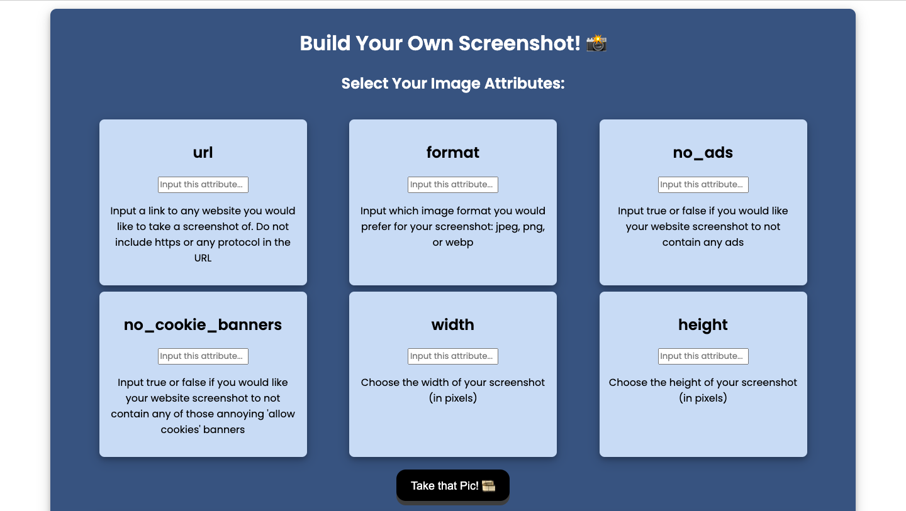

# Web Development Lab 4 - *Cap!*

Submitted by: **Kelly Chan**

This web app: **This app uses the ApiFlash API to take screenshots of a given website with a variety of parameters. I signed up for an ApiFlash account and explored the query builder that allows me to test out queries. Then, I will make a single static API call from my site. Finally, I will built an interface that allows you to get your own screenshots and insert them into the page.**

Time spent: **1.5** hours spent in total

## Required Features

The following **required** functionality is completed: 

- [X] Allow the user to add at least three parameters to a query to the ApiFlash API
- [X] Display the screenshot returned by the ApiFlash call on the page
- [X] On a separate part of the page, display all the images the user has queried thus far

## Image

Here's an image of implemented features:

## License

    Copyright 2025 Kelly Chan

    Licensed under the Apache License, Version 2.0 (the "License");
    you may not use this file except in compliance with the License.
    You may obtain a copy of the License at

        http://www.apache.org/licenses/LICENSE-2.0

    Unless required by applicable law or agreed to in writing, software
    distributed under the License is distributed on an "AS IS" BASIS,
    WITHOUT WARRANTIES OR CONDITIONS OF ANY KIND, either express or implied.
    See the License for the specific language governing permissions and
    limitations under the License.